OOD-aware single-head rejector (`with_leftout_ood_aware`): inner CV **scores every recipe at 3%, 5%, and 10%** requested operating risk (threshold logic per anchor), **`rank_inner_scores` produces a rank at each anchor**, then the **winning RHS minimizes the sum of those three ranks** (ties: lower worst rank, then better rank at 5%, 3%, 10%, then `rhs_key`). **Outer** evaluation and primary tables still use **5%** as the requested accepted risk for thresholding on the pool and target fold. The calibration curve CSV sweeps requested risks **1–10%** (0.5% steps) **holding that fused winner’s RHS** (threshold refit only).

Outputs from `Rscript R/calibration_reject_models.R`:

- `nested_target_risk_per_fold.csv` — one row per outer target fold with outer metrics for the fused inner winner (`inner_winner_optional_features`, ranks `inner_winner_inner_rank_p03` / `_p05` / `_p10`, `inner_winner_fusion_rank_sum`). **Outer requested accepted risk = 5%** for primary reporting.
- `nested_target_risk_summary_four_settings.csv` — aggregated by label set and CV/LOSO at **5%** (`modal_inner_winner_recipe` = most frequent exact winning recipe across folds).
- `nested_target_risk_summary_max_prob.csv` — same aggregation at **5%** for **`max_prob` only** (no inner feature selection).
- `nested_target_risk_summary_combined.csv` — both models in one table (`calibration_recipe` column).
- `nested_target_risk_feature_heatmap_long.csv` — feature selection frequency by setting (**5%**).
- `nested_target_risk_inner_scores_ranked.csv` — full inner CV grid per outer fold with `inner_rank` (**5%**).
- `nested_target_risk_calibration_curve.csv` — mean realized outer-fold **accepted risk** and **seen-class coverage** vs requested targets **1%, 1.5%, …, 10%** (step **0.5%**), using the **fused inner-winning RHS** (same recipe across that sweep; only the outer threshold is refit per requested risk).
- `nested_target_risk_calibration_curve_per_fold.csv` — same sweep, one curve per outer **target_fold** (no cross-fold aggregation).
- `nested_target_risk_calibration_compare.csv` — same risk sweep for **fused inner-best features** vs **`max_prob` only** (cross-fold means; for comparison plots and slope β in the Rmd).
- `nested_target_risk_full_coverage_summary.csv` — **100% seen-class coverage** baseline (accept all): mean risk and kappa per setting for **multivariate accept-all** and **classifier-only** (OOD-aware outer folds).
- `nested_target_risk_rejection_stratum_per_fold.csv` — per outer fold, % rejected by stratum (OOD / incorrect seen / correct seen) at **5%** with fused inner-winning RHS.
- `nested_target_risk_rejection_stratum_summary.csv` — same counts pooled within each label set × CV/LOSO setting.
- `nested_target_risk_rejection_stratum_loso_labels_averaged.csv` — **LOSO only**: unweighted mean of rejection % across full and collapsed label sets (manuscript sentence).
- `nested_target_risk_rejection_stratum_pooled.csv` — all splits and label sets combined (diagnostic only).

**Run the canonical script first** (from repo root):

`Rscript R/calibration_reject_models.R`


``` r
repo_root <- if (file.exists("R/outer_cv_analysis.R")) "." else ".."
out_dir <- file.path(repo_root, "data/out/outer_cv/calibration_feature_utility_selection_safe")

summary_path <- file.path(out_dir, "nested_target_risk_summary_four_settings.csv")
summary_max_prob_path <- file.path(out_dir, "nested_target_risk_summary_max_prob.csv")
summary_combined_path <- file.path(out_dir, "nested_target_risk_summary_combined.csv")
per_fold_path <- file.path(out_dir, "nested_target_risk_per_fold.csv")
heatmap_path <- file.path(out_dir, "nested_target_risk_feature_heatmap_long.csv")
inner_scores_path <- file.path(out_dir, "nested_target_risk_inner_scores_ranked.csv")
calibration_curve_path <- file.path(out_dir, "nested_target_risk_calibration_curve.csv")
calibration_curve_per_fold_path <- file.path(out_dir, "nested_target_risk_calibration_curve_per_fold.csv")
calibration_compare_path <- file.path(out_dir, "nested_target_risk_calibration_compare.csv")
full_coverage_summary_path <- file.path(out_dir, "nested_target_risk_full_coverage_summary.csv")
rejection_stratum_summary_path <- file.path(out_dir, "nested_target_risk_rejection_stratum_summary.csv")
rejection_stratum_loso_avg_path <- file.path(
  out_dir, "nested_target_risk_rejection_stratum_loso_labels_averaged.csv"
)

if (!file.exists(summary_path)) {
  stop(
    "Summary CSV not found. Run:\n  Rscript R/calibration_reject_models.R\n",
    "Expected: ", summary_path
  )
}

summary_df <- readr::read_csv(summary_path, show_col_types = FALSE)
summary_max_prob_df <- if (file.exists(summary_max_prob_path)) {
  readr::read_csv(summary_max_prob_path, show_col_types = FALSE)
} else {
  data.frame()
}
summary_combined_df <- if (file.exists(summary_combined_path)) {
  readr::read_csv(summary_combined_path, show_col_types = FALSE)
} else {
  data.frame()
}
per_fold_df <- if (file.exists(per_fold_path)) {
  readr::read_csv(per_fold_path, show_col_types = FALSE)
} else {
  data.frame()
}
heatmap_df <- if (file.exists(heatmap_path)) {
  readr::read_csv(heatmap_path, show_col_types = FALSE)
} else {
  data.frame()
}
inner_scores_df <- if (file.exists(inner_scores_path)) {
  readr::read_csv(inner_scores_path, show_col_types = FALSE)
} else {
  data.frame()
}
calibration_curve_df <- if (file.exists(calibration_curve_path)) {
  readr::read_csv(calibration_curve_path, show_col_types = FALSE)
} else {
  data.frame()
}
calibration_curve_per_fold_df <- if (file.exists(calibration_curve_per_fold_path)) {
  readr::read_csv(calibration_curve_per_fold_path, show_col_types = FALSE)
} else {
  data.frame()
}
calibration_compare_df <- if (file.exists(calibration_compare_path)) {
  readr::read_csv(calibration_compare_path, show_col_types = FALSE)
} else {
  data.frame()
}
full_coverage_summary_df <- if (file.exists(full_coverage_summary_path)) {
  readr::read_csv(full_coverage_summary_path, show_col_types = FALSE)
} else {
  data.frame()
}
rejection_stratum_summary_df <- if (file.exists(rejection_stratum_summary_path)) {
  readr::read_csv(rejection_stratum_summary_path, show_col_types = FALSE)
} else {
  data.frame()
}
rejection_stratum_loso_avg_df <- if (file.exists(rejection_stratum_loso_avg_path)) {
  readr::read_csv(rejection_stratum_loso_avg_path, show_col_types = FALSE)
} else {
  data.frame()
}
```

The summary table and heatmap below use outputs at **5%** requested accepted risk only. **Kappa** is Cohen's kappa on **accepted** samples only (pred vs truth).

## Summary by setting

Inner-winning multivariate recipe at **5%** requested accepted risk.


``` r
summary_display <- summary_df %>%
  mutate(
    split_type = toupper(as.character(split_type)),
    label_display = dplyr::recode(
      as.character(label_set),
      full_subtypes = "Full subtypes",
      collapsed_classes = "Collapsed"
    )
  ) %>%
  select(
    label_display, split_type, setting_col,
    scenario_key, scenario_name, modal_inner_winner_recipe,
    n_outer_folds,
    mean_outer_coverage_seen, sd_outer_coverage_seen,
    mean_outer_risk_all_accepted, sd_outer_risk_all_accepted,
    mean_outer_kappa_accepted, sd_outer_kappa_accepted
  ) %>%
  arrange(label_display, split_type)

#View(summary_display)
```

Probability-only (`max_prob`) rejector at **5%** requested accepted risk.


``` r
if (nrow(summary_max_prob_df) == 0L) {
  knitr::kable(data.frame(
    note = "No nested_target_risk_summary_max_prob.csv — rerun Rscript R/calibration_reject_models.R"
  ))
} else {
  summary_display_max_prob <- summary_max_prob_df %>%
    mutate(
      split_type = toupper(as.character(split_type)),
      label_display = dplyr::recode(
        as.character(label_set),
        full_subtypes = "Full subtypes",
        collapsed_classes = "Collapsed"
      )
    ) %>%
    select(
      label_display, split_type, setting_col,
      scenario_key, scenario_name, modal_inner_winner_recipe,
      n_outer_folds,
      mean_outer_coverage_seen, sd_outer_coverage_seen,
      mean_outer_risk_all_accepted, sd_outer_risk_all_accepted,
      mean_outer_kappa_accepted, sd_outer_kappa_accepted
    ) %>%
    arrange(label_display, split_type)

  #View(summary_display_max_prob)
}
```

### Multivariate vs max_prob (5% operating point)


``` r
format_summary_row <- function(df, calibration_model_label) {
  df %>%
    mutate(
      calibration_model = calibration_model_label,
      split_type = toupper(as.character(split_type)),
      label_display = dplyr::recode(
        as.character(label_set),
        full_subtypes = "Full subtypes",
        collapsed_classes = "Collapsed"
      ),
      mean_outer_coverage_seen_pct = 100 * mean_outer_coverage_seen,
      sd_outer_coverage_seen_pct = 100 * sd_outer_coverage_seen,
      mean_outer_risk_all_accepted_pct = 100 * mean_outer_risk_all_accepted,
      sd_outer_risk_all_accepted_pct = 100 * sd_outer_risk_all_accepted
    ) %>%
    select(
      calibration_model, label_display, split_type, setting_col,
      modal_inner_winner_recipe, n_outer_folds,
      mean_outer_coverage_seen_pct, sd_outer_coverage_seen_pct,
      mean_outer_risk_all_accepted_pct, sd_outer_risk_all_accepted_pct,
      mean_outer_kappa_accepted, sd_outer_kappa_accepted
    )
}

if (nrow(summary_combined_df) > 0L) {
  summary_compare_display <- summary_combined_df %>%
    mutate(
      calibration_model = dplyr::recode(
        as.character(calibration_recipe),
        inner_best_features = "Best features (inner winner)",
        max_prob_only = "Probability only (max_prob)"
      ),
      split_type = toupper(as.character(split_type)),
      label_display = dplyr::recode(
        as.character(label_set),
        full_subtypes = "Full subtypes",
        collapsed_classes = "Collapsed"
      ),
      mean_outer_coverage_seen_pct = 100 * mean_outer_coverage_seen,
      sd_outer_coverage_seen_pct = 100 * sd_outer_coverage_seen,
      mean_outer_risk_all_accepted_pct = 100 * mean_outer_risk_all_accepted,
      sd_outer_risk_all_accepted_pct = 100 * sd_outer_risk_all_accepted
    ) %>%
    select(
      calibration_model, label_display, split_type, setting_col,
      modal_inner_winner_recipe, n_outer_folds,
      mean_outer_coverage_seen_pct, sd_outer_coverage_seen_pct,
      mean_outer_risk_all_accepted_pct, sd_outer_risk_all_accepted_pct,
      mean_outer_kappa_accepted, sd_outer_kappa_accepted
    ) %>%
    arrange(label_display, split_type, calibration_model)
} else if (nrow(summary_df) > 0L && nrow(summary_max_prob_df) > 0L) {
  summary_compare_display <- dplyr::bind_rows(
    format_summary_row(summary_df, "Best features (inner winner)"),
    format_summary_row(summary_max_prob_df, "Probability only (max_prob)")
  ) %>%
    arrange(label_display, split_type, calibration_model)
} else {
  summary_compare_display <- data.frame(
    note = "Need summary CSVs — rerun Rscript R/calibration_reject_models.R"
  )
}

summary_compare_display %>% filter(split_type == "LOSO")
```

```
## # A tibble: 4 × 12
##   calibration_model  label_display split_type setting_col modal_inner_winner_r…¹
##   <chr>              <chr>         <chr>      <chr>       <chr>                 
## 1 Best features (in… Collapsed     LOSO       LOSO | Mer… entropy;knn10_mean_d;…
## 2 Probability only … Collapsed     LOSO       LOSO | Mer… max_prob (baseline on…
## 3 Best features (in… Full subtypes LOSO       LOSO | Full entropy;knn10_mean_d;…
## 4 Probability only … Full subtypes LOSO       LOSO | Full max_prob (baseline on…
## # ℹ abbreviated name: ¹​modal_inner_winner_recipe
## # ℹ 7 more variables: n_outer_folds <dbl>, mean_outer_coverage_seen_pct <dbl>,
## #   sd_outer_coverage_seen_pct <dbl>, mean_outer_risk_all_accepted_pct <dbl>,
## #   sd_outer_risk_all_accepted_pct <dbl>, mean_outer_kappa_accepted <dbl>,
## #   sd_outer_kappa_accepted <dbl>
```

## Publication: full-coverage baseline risk and kappa (OOD-aware)

At **100% seen-class coverage** (accept all samples, rejector threshold = 0): **risk** = accepted error rate (`accept_combined` target); **kappa** = Cohen's kappa on accepted predictions vs truth. **Multivariate** rows use the inner-winning recipe per fold; **classifier-only** = ensemble predictions with no rejector. Source: `nested_target_risk_full_coverage_summary.csv`.


``` r
if (nrow(full_coverage_summary_df) == 0L) {
  knitr::kable(data.frame(
    note = "No nested_target_risk_full_coverage_summary.csv — rerun Rscript R/calibration_reject_models.R"
  ))
} else {
  full_coverage_display <- full_coverage_summary_df %>%
    mutate(
      split_type = toupper(as.character(split_type)),
      label_display = dplyr::recode(
        as.character(label_set),
        full_subtypes = "Full subtypes",
        collapsed_classes = "Collapsed"
      ),
      baseline_kind = dplyr::recode(
        as.character(baseline_kind),
        multivariate_accept_all = "Multivariate (accept all)",
        classifier_only = "Classifier only (no rejector)"
      ),
      risk_pct = 100 * mean_outer_risk_all_accepted,
      sd_risk_pct = 100 * sd_outer_risk_all_accepted,
      coverage_seen_pct = 100 * mean_outer_coverage_seen
    ) %>%
    select(
      baseline_kind, label_display, split_type, setting_col, n_outer_folds,
      risk_pct, sd_risk_pct, coverage_seen_pct,
      mean_outer_kappa_accepted, sd_outer_kappa_accepted
    ) %>%
    arrange(baseline_kind, label_display, split_type)

  knitr::kable(full_coverage_display, digits = 2)

  publication_sentence <- function(df, label_set_key, label_label) {
    row <- df %>%
      filter(
        baseline_kind == "Multivariate (accept all)",
        label_set == label_set_key
      )
    if (nrow(row) != 2L) {
      return(sprintf("(%s: full-coverage summary incomplete — need CV and LOSO rows)", label_label))
    }
    loso <- row %>% filter(split_type == "LOSO")
    cv <- row %>% filter(split_type == "CV")
    sprintf(
      paste0(
        "[%s] We then evaluated the risk–coverage curve of the multivariate model and its ",
        "ability to filter mispredictions. In the setting that included unseen classes to better ",
        "approximate real-world application, the baseline risk at full coverage (100%%) was ",
        "%.1f%% in the LOSO setting (kappa = %.2f) and %.1f%% in the CV setting (kappa = %.2f)."
      ),
      label_label,
      loso$risk_pct[[1]],
      loso$mean_outer_kappa_accepted[[1]],
      cv$risk_pct[[1]],
      cv$mean_outer_kappa_accepted[[1]]
    )
  }

  mv_tbl <- full_coverage_display %>%
    filter(baseline_kind == "Multivariate (accept all)") %>%
    mutate(label_set = dplyr::recode(
      label_display,
      "Full subtypes" = "full_subtypes",
      "Collapsed" = "collapsed_classes"
    ))

  cat(publication_sentence(mv_tbl, "collapsed_classes", "Collapsed classes"), "\n\n")
  cat(publication_sentence(mv_tbl, "full_subtypes", "Full subtypes"), "\n")
}
```

```
## [Collapsed classes] We then evaluated the risk–coverage curve of the multivariate model and its ability to filter mispredictions. In the setting that included unseen classes to better approximate real-world application, the baseline risk at full coverage (100%) was 14.6% in the LOSO setting (kappa = 0.83) and 11.2% in the CV setting (kappa = 0.87). 
## 
## [Full subtypes] We then evaluated the risk–coverage curve of the multivariate model and its ability to filter mispredictions. In the setting that included unseen classes to better approximate real-world application, the baseline risk at full coverage (100%) was 16.6% in the LOSO setting (kappa = 0.81) and 13.4% in the CV setting (kappa = 0.85).
```

## Publication: rejection by outcome stratum (LOSO, 5% operating point)

**LOSO only.** At the **5%** requested accepted-risk operating point (fused inner-winning multivariate RHS per outer fold; rejected = `p_hat` below pool LOSO-OOF threshold). Manuscript percentages are the **unweighted mean** of rejection rates from **full subtypes** and **collapsed classes** LOSO rows. Source: `nested_target_risk_rejection_stratum_loso_labels_averaged.csv` (see `nested_target_risk_rejection_stratum_summary.csv` for per-label LOSO detail).


``` r
if (nrow(rejection_stratum_loso_avg_df) == 0L) {
  knitr::kable(data.frame(
    note = paste(
      "No nested_target_risk_rejection_stratum_loso_labels_averaged.csv —",
      "rerun Rscript R/calibration_reject_models.R"
    )
  ))
} else {
  loso_avg_display <- rejection_stratum_loso_avg_df %>%
    select(
      split_type, requested_target_risk_pct, n_outer_folds, n_label_sets_averaged,
      pct_rejected_ood, pct_rejected_incorrect_seen, pct_rejected_correct_seen
    )
  knitr::kable(loso_avg_display, digits = 1)

  if (nrow(rejection_stratum_summary_df) > 0L) {
    rejection_loso_by_label <- rejection_stratum_summary_df %>%
      filter(split_type == "loso") %>%
      mutate(label_display = label_set_to_display(label_set)) %>%
      select(
        label_display, n_outer_folds,
        pct_rejected_ood, pct_rejected_incorrect_seen, pct_rejected_correct_seen
      )
    knitr::kable(
      rejection_loso_by_label,
      digits = 1,
      caption = "LOSO per label set (inputs to the unweighted average above)"
    )
  }

  row <- rejection_stratum_loso_avg_df %>% slice(1)
  cat(
    sprintf(
      paste0(
        "At this target 5%% error rate for the LOSO setting, we found that averaged ",
        "across full and collapsed classification, %.1f%% of samples from unseen classes ",
        "and %.1f%% of misclassified samples were rejected, compared with %.1f%% of ",
        "correctly classified samples from seen classes."
      ),
      row$pct_rejected_ood[[1]],
      row$pct_rejected_incorrect_seen[[1]],
      row$pct_rejected_correct_seen[[1]]
    ),
    "\n"
  )
}
```

```
## At this target 5% error rate for the LOSO setting, we found that averaged across full and collapsed classification, 70.6% of samples from unseen classes and 72.4% of misclassified samples were rejected, compared with 13.7% of correctly classified samples from seen classes.
```

## Outer-fold detail


``` r
if (nrow(per_fold_df) == 0) {
  data.frame(note = "No per-fold CSV")
} else {
  per_fold_df %>%
    mutate(split_type = toupper(as.character(split_type))) %>%
    arrange(label_set, split_type, target_fold) %>%
    select(
      label_set, split_type, target_fold,
      scenario_key, scenario_name,
      outer_coverage_seen, outer_coverage_seen_median,
      outer_risk_all_accepted, outer_risk_all_accepted_median,
      outer_kappa_accepted, outer_kappa_accepted_median,
      inner_winner_optional_features
    )
}
```

```
## # A tibble: 24 × 12
##    label_set         split_type target_fold       scenario_key     scenario_name
##    <chr>             <chr>      <chr>             <chr>            <chr>        
##  1 collapsed_classes CV         0                 with_leftout_oo… Single-head …
##  2 collapsed_classes CV         1                 with_leftout_oo… Single-head …
##  3 collapsed_classes CV         2                 with_leftout_oo… Single-head …
##  4 collapsed_classes CV         3                 with_leftout_oo… Single-head …
##  5 collapsed_classes CV         4                 with_leftout_oo… Single-head …
##  6 collapsed_classes LOSO       100LUMC           with_leftout_oo… Single-head …
##  7 collapsed_classes LOSO       AAML03P1          with_leftout_oo… Single-head …
##  8 collapsed_classes LOSO       AAML0531          with_leftout_oo… Single-head …
##  9 collapsed_classes LOSO       AAML1031          with_leftout_oo… Single-head …
## 10 collapsed_classes LOSO       BEATAML1.0-COHORT with_leftout_oo… Single-head …
## # ℹ 14 more rows
## # ℹ 7 more variables: outer_coverage_seen <dbl>,
## #   outer_coverage_seen_median <dbl>, outer_risk_all_accepted <dbl>,
## #   outer_risk_all_accepted_median <dbl>, outer_kappa_accepted <dbl>,
## #   outer_kappa_accepted_median <dbl>, inner_winner_optional_features <chr>
```

## Inner grid: top candidates (inner_rank <= 15)

Full grid is in `nested_target_risk_inner_scores_ranked.csv`. Below: first outer target fold in each **(label_set, split_type)** group, top 15 inner ranks.


``` r
if (nrow(inner_scores_df) == 0) {
  knitr::kable(data.frame(note = "No inner_scores_ranked CSV; run calibration_reject_models.R"))
} else {
  inner_scores_df %>%
    group_by(label_set, split_type) %>%
    mutate(tf_chr = as.character(target_fold)) %>%
    filter(tf_chr == min(tf_chr)) %>%
    ungroup() %>%
    filter(inner_rank <= 15L) %>%
    arrange(label_set, split_type, inner_rank) %>%
    dplyr::select(dplyr::any_of(c(
      "label_set", "split_type", "target_fold", "scenario_key", "inner_rank",
      "inner_selection_tier", "recipe_optional_count", "dist_to_target",
      "mean_coverage", "sd_coverage", "mean_risk", "sd_risk",
      "rhs_key"
    ))) %>%
    knitr::kable()
}
```


|label_set         |split_type |target_fold |scenario_key           | inner_rank|inner_selection_tier | recipe_optional_count| dist_to_target| mean_coverage| sd_coverage| mean_risk|   sd_risk|rhs_key                                                                                                             |
|:-----------------|:----------|:-----------|:----------------------|----------:|:--------------------|---------------------:|--------------:|-------------:|-----------:|---------:|---------:|:-------------------------------------------------------------------------------------------------------------------|
|collapsed_classes |cv         |0           |with_leftout_ood_aware |          1|target_band          |                     5|      0.0019973|     0.9571918|   0.0230111| 0.0480027| 0.0080034|max_prob;margin;entropy;knn10_mean_d;knn10_min_d;knn10_q90_d                                                        |
|collapsed_classes |cv         |0           |with_leftout_ood_aware |          2|target_band          |                     5|      0.0003349|     0.9571918|   0.0245456| 0.0496651| 0.0082177|max_prob;margin;entropy;knn10_min_d;knn10_q90_d;conformal_set_size_90                                               |
|collapsed_classes |cv         |0           |with_leftout_ood_aware |          3|target_band          |                     4|      0.0019973|     0.9571918|   0.0230111| 0.0480027| 0.0080034|max_prob;margin;entropy;knn10_mean_d;knn10_q90_d                                                                    |
|collapsed_classes |cv         |0           |with_leftout_ood_aware |          4|target_band          |                     2|      0.0003691|     0.9577626|   0.0275554| 0.0496309| 0.0066113|max_prob;entropy;knn10_q90_d                                                                                        |
|collapsed_classes |cv         |0           |with_leftout_ood_aware |          5|target_band          |                     4|      0.0003620|     0.9583333|   0.0242608| 0.0496380| 0.0073546|max_prob;entropy;knn10_mean_d;knn10_q90_d;conformal_set_size_90                                                     |
|collapsed_classes |cv         |0           |with_leftout_ood_aware |          6|target_band          |                     6|      0.0008889|     0.9583333|   0.0227070| 0.0491111| 0.0067852|max_prob;margin;entropy;knn10_mean_d;knn10_min_d;knn10_q90_d;conformal_set_size_90                                  |
|collapsed_classes |cv         |0           |with_leftout_ood_aware |          7|target_band          |                     5|      0.0008889|     0.9583333|   0.0227070| 0.0491111| 0.0067852|max_prob;margin;entropy;knn10_mean_d;knn10_q90_d;conformal_set_size_90                                              |
|collapsed_classes |cv         |0           |with_leftout_ood_aware |          8|target_band          |                     2|      0.0003149|     0.9566210|   0.0280243| 0.0496851| 0.0065821|max_prob;entropy;knn10_mean_d                                                                                       |
|collapsed_classes |cv         |0           |with_leftout_ood_aware |          9|target_band          |                     3|      0.0014151|     0.9560502|   0.0248970| 0.0485849| 0.0079242|max_prob;margin;entropy;knn10_min_d                                                                                 |
|collapsed_classes |cv         |0           |with_leftout_ood_aware |         10|target_band          |                     3|      0.0009402|     0.9577626|   0.0269819| 0.0490598| 0.0070476|max_prob;margin;entropy;knn10_q90_d                                                                                 |
|collapsed_classes |cv         |0           |with_leftout_ood_aware |         11|target_band          |                     4|      0.0000571|     0.9503425|   0.0212852| 0.0499429| 0.0057135|max_prob;margin;knn10_mean_d;knn10_q90_d;conformal_set_size_90                                                      |
|collapsed_classes |cv         |0           |with_leftout_ood_aware |         12|target_band          |                     5|      0.0003739|     0.9571918|   0.0276733| 0.0496261| 0.0106201|max_prob;margin;entropy;top1_prob_variance_across_models;knn10_mean_d;knn10_q90_d                                   |
|collapsed_classes |cv         |0           |with_leftout_ood_aware |         13|target_band          |                     7|      0.0009459|     0.9571918|   0.0277360| 0.0490541| 0.0104548|max_prob;margin;entropy;top1_prob_variance_across_models;knn10_mean_d;knn10_min_d;knn10_q90_d;conformal_set_size_90 |
|collapsed_classes |cv         |0           |with_leftout_ood_aware |         14|target_band          |                     5|      0.0000571|     0.9503425|   0.0212852| 0.0499429| 0.0057135|max_prob;margin;knn10_mean_d;knn10_min_d;knn10_q90_d;conformal_set_size_90                                          |
|collapsed_classes |cv         |0           |with_leftout_ood_aware |         15|target_band          |                     4|      0.0007192|     0.9520548|   0.0210079| 0.0492808| 0.0066560|max_prob;margin;knn10_min_d;knn10_q90_d;conformal_set_size_90                                                       |
|collapsed_classes |loso       |100LUMC     |with_leftout_ood_aware |          1|target_band          |                     3|      0.0014627|     0.8985682|   0.0425255| 0.0485373| 0.0314627|max_prob;entropy;knn10_min_d;conformal_set_size_90                                                                  |
|collapsed_classes |loso       |100LUMC     |with_leftout_ood_aware |          2|outside_band         |                     4|      0.0002845|     0.8993869|   0.0552874| 0.0502845| 0.0304853|max_prob;margin;entropy;knn10_mean_d;knn10_q90_d                                                                    |
|collapsed_classes |loso       |100LUMC     |with_leftout_ood_aware |          3|outside_band         |                     6|      0.0003273|     0.9004203|   0.0510182| 0.0503273| 0.0291603|max_prob;margin;entropy;knn10_mean_d;knn10_min_d;knn10_q90_d;conformal_set_size_90                                  |
|collapsed_classes |loso       |100LUMC     |with_leftout_ood_aware |          4|outside_band         |                     5|      0.0002179|     0.9037204|   0.0474520| 0.0502179| 0.0295132|max_prob;margin;entropy;knn10_min_d;knn10_q90_d;conformal_set_size_90                                               |
|collapsed_classes |loso       |100LUMC     |with_leftout_ood_aware |          5|outside_band         |                     5|      0.0007573|     0.9045907|   0.0469509| 0.0507573| 0.0300301|max_prob;margin;entropy;knn10_mean_d;knn10_min_d;conformal_set_size_90                                              |
|collapsed_classes |loso       |100LUMC     |with_leftout_ood_aware |          6|outside_band         |                     5|      0.0011768|     0.9056061|   0.0492017| 0.0511768| 0.0301824|max_prob;margin;entropy;knn10_mean_d;knn10_min_d;knn10_q90_d                                                        |
|collapsed_classes |loso       |100LUMC     |with_leftout_ood_aware |          7|outside_band         |                     5|      0.0004920|     0.8992926|   0.0530416| 0.0504920| 0.0299824|max_prob;margin;entropy;knn10_mean_d;knn10_q90_d;conformal_set_size_90                                              |
|collapsed_classes |loso       |100LUMC     |with_leftout_ood_aware |          8|target_band          |                     5|      0.0012879|     0.8458560|   0.1300640| 0.0487121| 0.0336256|max_prob;entropy;top1_prob_variance_across_models;knn10_mean_d;knn10_min_d;knn10_q90_d                              |
|collapsed_classes |loso       |100LUMC     |with_leftout_ood_aware |          9|outside_band         |                     2|      0.0009413|     0.9046954|   0.0508746| 0.0509413| 0.0291681|max_prob;margin;entropy                                                                                             |
|collapsed_classes |loso       |100LUMC     |with_leftout_ood_aware |         10|outside_band         |                     3|      0.0013006|     0.9060882|   0.0521340| 0.0513006| 0.0295423|max_prob;margin;entropy;knn10_min_d                                                                                 |
|collapsed_classes |loso       |100LUMC     |with_leftout_ood_aware |         11|outside_band         |                     4|      0.0009462|     0.9076031|   0.0456670| 0.0509462| 0.0299006|max_prob;margin;entropy;knn10_min_d;knn10_q90_d                                                                     |
|collapsed_classes |loso       |100LUMC     |with_leftout_ood_aware |         12|outside_band         |                     3|      0.0014748|     0.9010621|   0.0524549| 0.0514748| 0.0295018|max_prob;margin;entropy;conformal_set_size_90                                                                       |
|collapsed_classes |loso       |100LUMC     |with_leftout_ood_aware |         13|outside_band         |                     3|      0.0018706|     0.9064253|   0.0498543| 0.0518706| 0.0288210|max_prob;margin;entropy;knn10_q90_d                                                                                 |
|collapsed_classes |loso       |100LUMC     |with_leftout_ood_aware |         14|outside_band         |                     3|      0.0018898|     0.9060541|   0.0498423| 0.0518898| 0.0288189|max_prob;margin;entropy;knn10_mean_d                                                                                |
|collapsed_classes |loso       |100LUMC     |with_leftout_ood_aware |         15|outside_band         |                     4|      0.0009185|     0.9076689|   0.0469647| 0.0509185| 0.0298878|max_prob;margin;entropy;knn10_mean_d;knn10_min_d                                                                    |
|full_subtypes     |cv         |0           |with_leftout_ood_aware |          1|target_band          |                     6|      0.0005473|     0.8692922|   0.0503794| 0.0494527| 0.0161907|max_prob;margin;entropy;top1_prob_variance_across_models;knn10_mean_d;knn10_min_d;knn10_q90_d                       |
|full_subtypes     |cv         |0           |with_leftout_ood_aware |          2|target_band          |                     2|      0.0001188|     0.8738584|   0.0408148| 0.0498812| 0.0163684|max_prob;knn10_mean_d;knn10_q90_d                                                                                   |
|full_subtypes     |cv         |0           |with_leftout_ood_aware |          3|target_band          |                     7|      0.0017756|     0.8664384|   0.0540442| 0.0482244| 0.0171937|max_prob;margin;entropy;top1_prob_variance_across_models;knn10_mean_d;knn10_min_d;knn10_q90_d;conformal_set_size_90 |
|full_subtypes     |cv         |0           |with_leftout_ood_aware |          4|target_band          |                     1|      0.0015473|     0.8647260|   0.0581296| 0.0484527| 0.0151544|max_prob;conformal_set_size_90                                                                                      |
|full_subtypes     |cv         |0           |with_leftout_ood_aware |          5|target_band          |                     2|      0.0004120|     0.8595890|   0.0600157| 0.0495880| 0.0198223|max_prob;knn10_min_d;knn10_q90_d                                                                                    |
|full_subtypes     |cv         |0           |with_leftout_ood_aware |          6|target_band          |                     3|      0.0001084|     0.8738584|   0.0403007| 0.0498916| 0.0164121|max_prob;knn10_mean_d;knn10_min_d;knn10_q90_d                                                                       |
|full_subtypes     |cv         |0           |with_leftout_ood_aware |          7|outside_band         |                     6|      0.0002201|     0.8675799|   0.0488606| 0.0502201| 0.0166077|max_prob;margin;top1_prob_variance_across_models;knn10_mean_d;knn10_min_d;knn10_q90_d;conformal_set_size_90         |
|full_subtypes     |cv         |0           |with_leftout_ood_aware |          8|target_band          |                     2|      0.0001858|     0.8584475|   0.0646835| 0.0498142| 0.0171209|max_prob;knn10_q90_d;conformal_set_size_90                                                                          |
|full_subtypes     |cv         |0           |with_leftout_ood_aware |          9|target_band          |                     2|      0.0009704|     0.8607306|   0.0606350| 0.0490296| 0.0182564|max_prob;knn10_mean_d;conformal_set_size_90                                                                         |
|full_subtypes     |cv         |0           |with_leftout_ood_aware |         10|outside_band         |                     2|      0.0006448|     0.8618721|   0.0574115| 0.0506448| 0.0130439|max_prob;top1_prob_variance_across_models;conformal_set_size_90                                                     |
|full_subtypes     |cv         |0           |with_leftout_ood_aware |         11|outside_band         |                     2|      0.0010298|     0.8607306|   0.0612905| 0.0510298| 0.0162774|max_prob;top1_prob_variance_across_models;knn10_q90_d                                                               |
|full_subtypes     |cv         |0           |with_leftout_ood_aware |         12|outside_band         |                     2|      0.0001831|     0.8624429|   0.0561221| 0.0501831| 0.0189718|max_prob;margin;knn10_min_d                                                                                         |
|full_subtypes     |cv         |0           |with_leftout_ood_aware |         13|target_band          |                     5|      0.0010615|     0.8721461|   0.0587428| 0.0489385| 0.0193727|max_prob;margin;entropy;knn10_mean_d;knn10_q90_d;conformal_set_size_90                                              |
|full_subtypes     |cv         |0           |with_leftout_ood_aware |         14|outside_band         |                     0|      0.0001409|     0.8664384|   0.0580136| 0.0501409| 0.0164710|max_prob                                                                                                            |
|full_subtypes     |cv         |0           |with_leftout_ood_aware |         15|target_band          |                     1|      0.0000700|     0.8704338|   0.0579799| 0.0499300| 0.0164916|max_prob;margin                                                                                                     |
|full_subtypes     |loso       |100LUMC     |with_leftout_ood_aware |          1|outside_band         |                     4|      0.0035523|     0.8258182|   0.0985680| 0.0535523| 0.0365015|max_prob;entropy;knn10_mean_d;knn10_q90_d;conformal_set_size_90                                                     |
|full_subtypes     |loso       |100LUMC     |with_leftout_ood_aware |          2|outside_band         |                     5|      0.0032627|     0.8231599|   0.1042839| 0.0532627| 0.0366048|max_prob;entropy;knn10_mean_d;knn10_min_d;knn10_q90_d;conformal_set_size_90                                         |
|full_subtypes     |loso       |100LUMC     |with_leftout_ood_aware |          3|outside_band         |                     3|      0.0042050|     0.8296820|   0.0955793| 0.0542050| 0.0387803|max_prob;entropy;knn10_mean_d;knn10_q90_d                                                                           |
|full_subtypes     |loso       |100LUMC     |with_leftout_ood_aware |          4|outside_band         |                     5|      0.0056409|     0.8203748|   0.0966940| 0.0556409| 0.0398846|max_prob;margin;entropy;knn10_mean_d;knn10_min_d;conformal_set_size_90                                              |
|full_subtypes     |loso       |100LUMC     |with_leftout_ood_aware |          5|outside_band         |                     5|      0.0054427|     0.8240317|   0.0907749| 0.0554427| 0.0396528|max_prob;margin;entropy;knn10_mean_d;knn10_q90_d;conformal_set_size_90                                              |
|full_subtypes     |loso       |100LUMC     |with_leftout_ood_aware |          6|outside_band         |                     5|      0.0051467|     0.8210458|   0.0940682| 0.0551467| 0.0394674|max_prob;margin;entropy;knn10_min_d;knn10_q90_d;conformal_set_size_90                                               |
|full_subtypes     |loso       |100LUMC     |with_leftout_ood_aware |          7|outside_band         |                     3|      0.0057795|     0.8230483|   0.1036476| 0.0557795| 0.0405636|max_prob;entropy;knn10_mean_d;conformal_set_size_90                                                                 |
|full_subtypes     |loso       |100LUMC     |with_leftout_ood_aware |          8|outside_band         |                     4|      0.0059281|     0.8256869|   0.0999176| 0.0559281| 0.0392378|max_prob;entropy;knn10_min_d;knn10_q90_d;conformal_set_size_90                                                      |
|full_subtypes     |loso       |100LUMC     |with_leftout_ood_aware |          9|outside_band         |                     4|      0.0064900|     0.8263317|   0.0991160| 0.0564900| 0.0399744|max_prob;entropy;knn10_mean_d;knn10_min_d;conformal_set_size_90                                                     |
|full_subtypes     |loso       |100LUMC     |with_leftout_ood_aware |         10|outside_band         |                     6|      0.0064389|     0.8245705|   0.0931606| 0.0564389| 0.0406774|max_prob;margin;entropy;knn10_mean_d;knn10_min_d;knn10_q90_d;conformal_set_size_90                                  |
|full_subtypes     |loso       |100LUMC     |with_leftout_ood_aware |         11|outside_band         |                     4|      0.0074385|     0.8236265|   0.0930927| 0.0574385| 0.0418419|max_prob;margin;entropy;knn10_q90_d;conformal_set_size_90                                                           |
|full_subtypes     |loso       |100LUMC     |with_leftout_ood_aware |         12|outside_band         |                     2|      0.0065078|     0.8268273|   0.0948041| 0.0565078| 0.0409576|max_prob;entropy;knn10_min_d                                                                                        |
|full_subtypes     |loso       |100LUMC     |with_leftout_ood_aware |         13|outside_band         |                     4|      0.0068091|     0.8281583|   0.0878882| 0.0568091| 0.0410782|max_prob;margin;entropy;knn10_mean_d;knn10_q90_d                                                                    |
|full_subtypes     |loso       |100LUMC     |with_leftout_ood_aware |         14|outside_band         |                     4|      0.0080450|     0.6677810|   0.1830281| 0.0419550| 0.0400592|max_prob;entropy;top1_prob_variance_across_models;knn10_q90_d;conformal_set_size_90                                 |
|full_subtypes     |loso       |100LUMC     |with_leftout_ood_aware |         15|outside_band         |                     4|      0.0034304|     0.8282237|   0.0959866| 0.0534304| 0.0385042|max_prob;entropy;knn10_mean_d;knn10_min_d;knn10_q90_d                                                               |

## Feature selection frequency heatmap

Rows: optional features (excluding baseline `max_prob`). Columns: **CV/LOSO | label set**. Cell: fraction of outer folds where the inner-winning recipe included the feature.


``` r
if (nrow(heatmap_df) == 0) {
  data.frame(note = "No heatmap CSV; run calibration_reject_models.R")
} else {
  # Human-readable labels for optional rejector features.
  feature_pretty_map <- c(
    margin = "Top-1 vs Top-2 margin",
    entropy = "Prediction entropy",
    top1_prob_variance_across_models = "Top-1 probability variance across models",
    knn10_mean_d = "kNN (k=10) mean distance",
    knn10_min_d = "kNN (k=10) minimum distance",
    knn10_q90_d = "kNN (k=10) 90th percentile distance",
    conformal_set_size_90 = "Conformal set size (90%)"
  )

  col_levels_raw <- unique(as.character(heatmap_df$setting_col))
  # Put LOSO settings first, then CV (stable within each split).
  col_levels <- c(
    sort(col_levels_raw[grepl("^LOSO\\s*\\|", col_levels_raw)]),
    sort(col_levels_raw[grepl("^CV\\s*\\|", col_levels_raw)]),
    sort(setdiff(col_levels_raw, c(
      col_levels_raw[grepl("^LOSO\\s*\\|", col_levels_raw)],
      col_levels_raw[grepl("^CV\\s*\\|", col_levels_raw)]
    )))
  )
  if (length(col_levels) == 0L) {
    data.frame(note = "Empty heatmap levels")
  } else {
    feature_levels <- sort(unique(as.character(heatmap_df$feature)))
    feature_levels_pretty <- vapply(
      feature_levels,
      function(f) dplyr::recode(f, !!!feature_pretty_map, .default = f),
      FUN.VALUE = character(1)
    )

    h <- heatmap_df %>%
      tidyr::complete(feature, setting_col = col_levels, fill = list(frac_outer_folds_selected = 0)) %>%
      mutate(
        setting_col = factor(setting_col, levels = col_levels),
        feature_pretty = dplyr::recode(as.character(feature), !!!feature_pretty_map, .default = as.character(feature)),
        feature_pretty = factor(feature_pretty, levels = feature_levels_pretty)
      )

    p_features_hm <- ggplot(h, aes(x = setting_col, y = feature_pretty, fill = frac_outer_folds_selected)) +
      geom_tile(color = "white", linewidth = 0.3) +
      scale_fill_gradient(limits = c(0, 1), low = "white", high = "#2171b5", name = "Fold fraction") +
      theme_bw() +
      theme(
        axis.text.x = element_text(angle = 55, hjust = 1, size = 7),
        panel.grid = element_blank()
      ) +
      labs(
        title = "Selected features in best inner recipe",
        x = NULL,
        y = NULL
      )
  }
}
p_features_hm
```

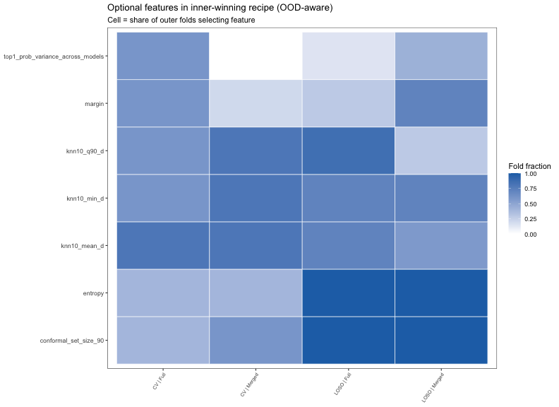

## Requested vs realized risk and coverage (1–10% targets, 0.5% steps)

Same spirit as the deployable operating-point curves in `analyse_results.Rmd`. **Inner RHS is the fused winner** (best sum of ranks across inner grids at 3%, 5%, 10%); x-axis requested risks run **from 1% to 10% in 0.5% steps**; for each point the outer threshold is chosen from pool LOSO-OOF at that risk; ribbons use fold-wise SE (95% normal approximation). Source: `nested_target_risk_calibration_curve.csv`.


``` r
if (nrow(calibration_curve_df) == 0L) {
  knitr::kable(data.frame(note = "No nested_target_risk_calibration_curve.csv — rerun Rscript R/calibration_reject_models.R"))
} else {
  curve_plot_df <- calibration_curve_df %>%
    mutate(
      split_type_fac = factor(toupper(split_type), levels = SPLIT_TYPE_LEVELS),
      label_display = label_set_to_display(label_set)
    )

  p_nested_requested_vs_realized_risk <- ggplot(
    curve_plot_df,
    aes(x = requested_target_risk_pct, y = realized_risk_pct)
  ) +
    geom_ribbon(
      aes(ymin = realized_risk_ci95_lo_pct, ymax = realized_risk_ci95_hi_pct),
      alpha = 0.14
    ) +
    geom_line(linewidth = 1) +
    geom_point(size = 1.8) +
    geom_abline(slope = 1, intercept = 0, linetype = "dashed", color = "grey40") +
    facet_grid(label_display ~ split_type_fac) +
    labs(
      title = "Requested vs realized accepted risk",
      subtitle = "Ribbons = 95% CI",
      x = "Requested risk target (%)",
      y = "Realized accepted risk (%)"
    ) +
    theme_bw()
  print(p_nested_requested_vs_realized_risk)

  p_nested_requested_vs_coverage <- ggplot(
    curve_plot_df,
    aes(x = requested_target_risk_pct, y = realized_coverage_seen_pct)
  ) +
    geom_ribbon(
      aes(ymin = realized_coverage_seen_ci95_lo_pct, ymax = realized_coverage_seen_ci95_hi_pct),
      alpha = 0.14
    ) +
    geom_line(linewidth = 1) +
    geom_point(size = 1.8) +
    facet_grid(label_display ~ split_type_fac) +
    labs(
      title = "Requested risk vs realized seen-class coverage",
      subtitle = "Ribbons = 95% CI",
      x = "Requested risk target (%)",
      y = "Realized seen-class coverage (%)"
    ) +
    theme_bw()
  print(p_nested_requested_vs_coverage)
}
```

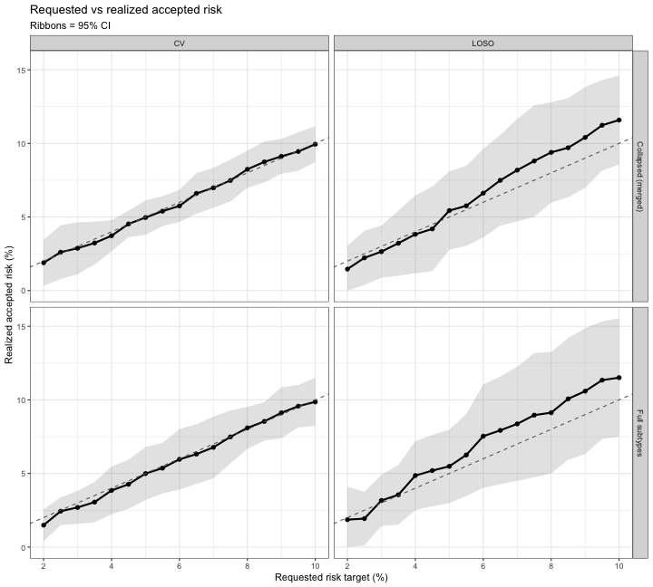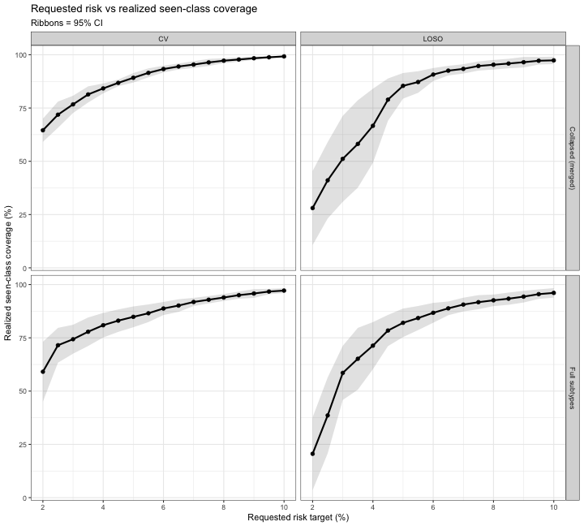

### By label set only (CV green, LOSO purple)

Same mean + 95% CI as above; **one panel per label set**, CV and LOSO overlaid.


``` r
if (nrow(calibration_curve_df) == 0L) {
  knitr::kable(data.frame(note = "No nested_target_risk_calibration_curve.csv — rerun Rscript R/calibration_reject_models.R"))
} else {
  split_colors <- c("CV" = "#2ca25f", "LOSO" = "#756bb1")

  curve_by_label_df <- calibration_curve_df %>%
    mutate(
      split_type_fac = factor(toupper(split_type), levels = SPLIT_TYPE_LEVELS),
      label_display = label_set_to_display(label_set),
      # For this two-panel comparison: Full left, Collapsed right.
      label_display = factor(
        as.character(label_display),
        levels = c("Full subtypes", "Collapsed (merged)")
      )
    )

  p_nested_by_label_requested_vs_realized_risk <- ggplot(
    curve_by_label_df,
    aes(
      x = requested_target_risk_pct,
      y = realized_risk_pct,
      color = split_type_fac,
      fill = split_type_fac,
      group = split_type_fac
    )
  ) +
    geom_ribbon(
      aes(ymin = realized_risk_ci95_lo_pct, ymax = realized_risk_ci95_hi_pct),
      alpha = 0.18,
      color = NA
    ) +
    geom_line(linewidth = 1) +
    geom_point(size = 1.6) +
    geom_abline(slope = 1, intercept = 0, linetype = "dashed", color = "grey40") +
    scale_color_manual(values = split_colors, name = "Split") +
    scale_fill_manual(values = split_colors, name = "Split") +
    facet_wrap(~ label_display, ncol = 2) +
    labs(
      title = "Requested vs realized accepted risk",
      x = "Requested risk target (%)",
      y = "Realized accepted risk (%)"
    ) +
    theme_bw() +
    theme(legend.position = "bottom")
 # print(p_nested_by_label_requested_vs_realized_risk)

  p_nested_by_label_requested_vs_coverage <- ggplot(
    curve_by_label_df,
    aes(
      x = requested_target_risk_pct,
      y = realized_coverage_seen_pct,
      color = split_type_fac,
      fill = split_type_fac,
      group = split_type_fac
    )
  ) +
    geom_ribbon(
      aes(ymin = realized_coverage_seen_ci95_lo_pct, ymax = realized_coverage_seen_ci95_hi_pct),
      alpha = 0.18,
      color = NA
    ) +
    geom_line(linewidth = 1) +
    geom_point(size = 1.6) +
    scale_color_manual(values = split_colors, name = "Split") +
    scale_fill_manual(values = split_colors, name = "Split") +
    facet_wrap(~ label_display, ncol = 2) +
    labs(
      title = "Requested risk vs realized seen-class coverage",
      x = "Requested risk target (%)",
      y = "Realized seen-class coverage (%)"
    ) +
    theme_bw() +
    theme(legend.position = "bottom")
 # print(p_nested_by_label_requested_vs_coverage)
}

p1 <- p_nested_by_label_requested_vs_realized_risk/p_nested_by_label_requested_vs_coverage+ plot_layout(guides = "collect") & theme(legend.position = 'bottom')
p1
```


### Per outer fold

Same setup as above; one line per **target_fold** (no ribbons). Source: `nested_target_risk_calibration_curve_per_fold.csv`.


``` r
if (nrow(calibration_curve_per_fold_df) == 0L) {
  knitr::kable(data.frame(
    note = "No nested_target_risk_calibration_curve_per_fold.csv — rerun Rscript R/calibration_reject_models.R"
  ))
} else {
  curve_pf_plot_df <- calibration_curve_per_fold_df %>%
    mutate(
      split_type_fac = factor(toupper(split_type), levels = SPLIT_TYPE_LEVELS),
      label_display = label_set_to_display(label_set),
      target_fold = as.character(target_fold)
    )

  p_nested_pf_requested_vs_realized_risk <- ggplot(
    curve_pf_plot_df,
    aes(
      x = requested_target_risk_pct,
      y = realized_risk_pct,
      group = target_fold,
      color = target_fold
    )
  ) +
    geom_line(linewidth = 0.7, alpha = 0.85) +
    geom_abline(slope = 1, intercept = 0, linetype = "dashed", color = "grey40") +
    facet_grid(label_display ~ split_type_fac) +
    labs(
      title = "Requested vs realized accepted risk (per outer fold)",
      subtitle = "One line per held-out target fold",
      x = "Requested risk target (%)",
      y = "Realized accepted risk (%)",
      color = "Target fold"
    ) +
    theme_bw() +
    theme(legend.position = "bottom")
  print(p_nested_pf_requested_vs_realized_risk)

  p_nested_pf_requested_vs_coverage <- ggplot(
    curve_pf_plot_df,
    aes(
      x = requested_target_risk_pct,
      y = realized_coverage_seen_pct,
      group = target_fold,
      color = target_fold
    )
  ) +
    geom_line(linewidth = 0.7, alpha = 0.85) +
    facet_grid(label_display ~ split_type_fac) +
    labs(
      title = "Requested risk vs realized seen-class coverage (per outer fold)",
      subtitle = "One line per held-out target fold",
      x = "Requested risk target (%)",
      y = "Realized seen-class coverage (%)",
      color = "Target fold"
    ) +
    theme_bw() +
    theme(legend.position = "bottom")
  print(p_nested_pf_requested_vs_coverage)
}
```

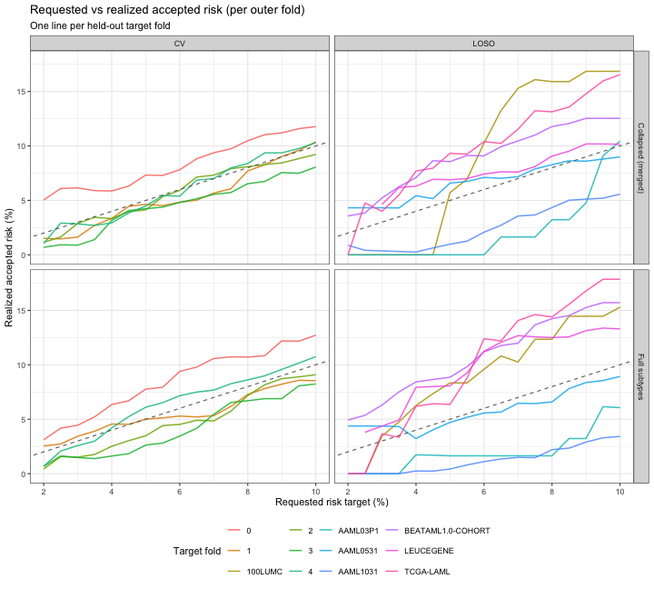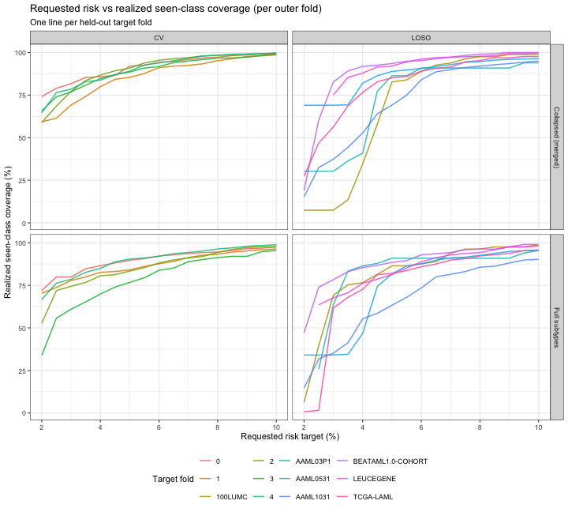

### Mean line with per-fold points

Black line = cross-fold mean (`nested_target_risk_calibration_curve.csv`); grey points = individual outer folds (`nested_target_risk_calibration_curve_per_fold.csv`).


``` r
if (nrow(calibration_curve_df) == 0L || nrow(calibration_curve_per_fold_df) == 0L) {
  knitr::kable(data.frame(
    note = "Need both calibration curve CSVs — rerun Rscript R/calibration_reject_models.R"
  ))
} else {
  curve_mean_plot_df <- calibration_curve_df %>%
    mutate(
      split_type_fac = factor(toupper(split_type), levels = SPLIT_TYPE_LEVELS),
      label_display = label_set_to_display(label_set)
    )
  curve_pf_pts_df <- calibration_curve_per_fold_df %>%
    mutate(
      split_type_fac = factor(toupper(split_type), levels = SPLIT_TYPE_LEVELS),
      label_display = label_set_to_display(label_set)
    )

  p_nested_mean_pts_requested_vs_realized_risk <- ggplot() +
    geom_point(
      data = curve_pf_pts_df,
      aes(x = requested_target_risk_pct, y = realized_risk_pct),
      color = "grey55",
      alpha = 0.55,
      size = 1.1
    ) +
    geom_line(
      data = curve_mean_plot_df,
      aes(x = requested_target_risk_pct, y = realized_risk_pct),
      color = "black",
      linewidth = 1
    ) +
    geom_abline(slope = 1, intercept = 0, linetype = "dashed", color = "grey40") +
    facet_grid(label_display ~ split_type_fac) +
    labs(
      title = "Requested vs realized accepted risk (mean + folds)",
      subtitle = "Black line = cross-fold mean; grey points = outer folds",
      x = "Requested risk target (%)",
      y = "Realized accepted risk (%)"
    ) +
    theme_bw()
  print(p_nested_mean_pts_requested_vs_realized_risk)

  p_nested_mean_pts_requested_vs_coverage <- ggplot() +
    geom_point(
      data = curve_pf_pts_df,
      aes(x = requested_target_risk_pct, y = realized_coverage_seen_pct),
      color = "grey55",
      alpha = 0.55,
      size = 1.1
    ) +
    geom_line(
      data = curve_mean_plot_df,
      aes(x = requested_target_risk_pct, y = realized_coverage_seen_pct),
      color = "black",
      linewidth = 1
    ) +
    facet_grid(label_display ~ split_type_fac) +
    labs(
      title = "Requested risk vs realized seen-class coverage (mean + folds)",
      subtitle = "Black line = cross-fold mean; grey points = outer folds",
      x = "Requested risk target (%)",
      y = "Realized seen-class coverage (%)"
    ) +
    theme_bw()
  print(p_nested_mean_pts_requested_vs_coverage)
}
```

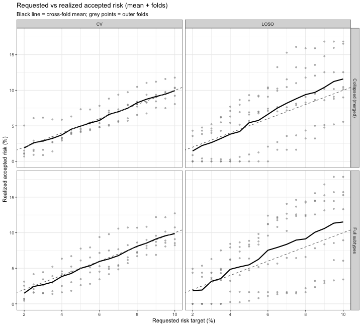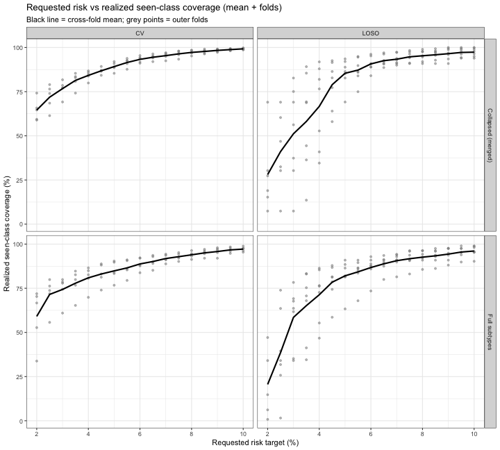

## Best features vs max_prob only

Same risk sweep (**1–10%**, 0.5% steps). **Red** = fused inner-best recipe; **blue** = `max_prob` only. Ribbons/error bars = 95% CI across outer folds. Source: `nested_target_risk_calibration_compare.csv`.


``` r
if (nrow(calibration_compare_df) == 0L) {
  knitr::kable(data.frame(
    note = "No nested_target_risk_calibration_compare.csv — rerun Rscript R/calibration_reject_models.R"
  ))
} else {
  recipe_colors <- c(
    inner_best_features = "#d62728",
    max_prob_only = "#1f77b4"
  )
  recipe_labels <- c("Best features", "Max AML class probability only")

  compare_plot_df <- calibration_compare_df %>%
    arrange(label_set, split_type, calibration_recipe, requested_target_risk_pct) %>%
    mutate(
      split_type_fac = factor(toupper(split_type), levels = SPLIT_TYPE_LEVELS),
      label_display = label_set_to_display(label_set),
      calibration_recipe = factor(
        as.character(calibration_recipe),
        levels = c("inner_best_features", "max_prob_only")
      )
    )

  p_compare_requested_vs_realized_risk <- ggplot(
    compare_plot_df,
    aes(
      x = requested_target_risk_pct,
      y = realized_risk_pct,
      color = calibration_recipe,
      fill = calibration_recipe,
      group = calibration_recipe
    )
  ) +
    geom_ribbon(
      aes(ymin = realized_risk_ci95_lo_pct, ymax = realized_risk_ci95_hi_pct),
      alpha = 0.18,
      color = NA
    ) +
    geom_line(linewidth = 1) +
    geom_point(size = 1.6) +
    geom_abline(slope = 1, intercept = 0, linetype = "dashed", color = "grey40") +
    scale_color_manual(values = recipe_colors, labels = recipe_labels, name = NULL) +
    scale_fill_manual(values = recipe_colors, labels = recipe_labels, name = NULL) +
    facet_grid(label_display ~ split_type_fac) +
    labs(
      title = "Requested vs realized risk",
      subtitle = "Ribbons = 95% CI",
      x = "Requested risk target (%)",
      y = "Realized accepted risk (%)"
    ) +
    theme_bw() +
    theme(legend.position = "bottom")
  print(p_compare_requested_vs_realized_risk)

  p_compare_risk_vs_coverage <- ggplot(
    compare_plot_df,
    aes(
      x = requested_target_risk_pct,
      y = realized_coverage_seen_pct,
      color = calibration_recipe,
      fill = calibration_recipe,
      group = calibration_recipe
    )
  ) +
    geom_ribbon(
      aes(ymin = realized_coverage_seen_ci95_lo_pct, ymax = realized_coverage_seen_ci95_hi_pct),
      alpha = 0.18,
      color = NA
    ) +
    geom_path(linewidth = 1) +
    geom_point(size = 1.6) +
    scale_color_manual(values = recipe_colors, labels = recipe_labels, name = NULL) +
    scale_fill_manual(values = recipe_colors, labels = recipe_labels, name = NULL) +
    facet_grid(label_display ~ split_type_fac) +
    labs(
      title = "Realized risk vs seen-class coverage",
      subtitle = "Ribbons = 95% CI",
      x = "Requested risk (%)",
      y = "Realized seen-class coverage (%)"
    ) +
    theme_bw() +
    theme(legend.position = "bottom")
  print(p_compare_risk_vs_coverage)
}
```

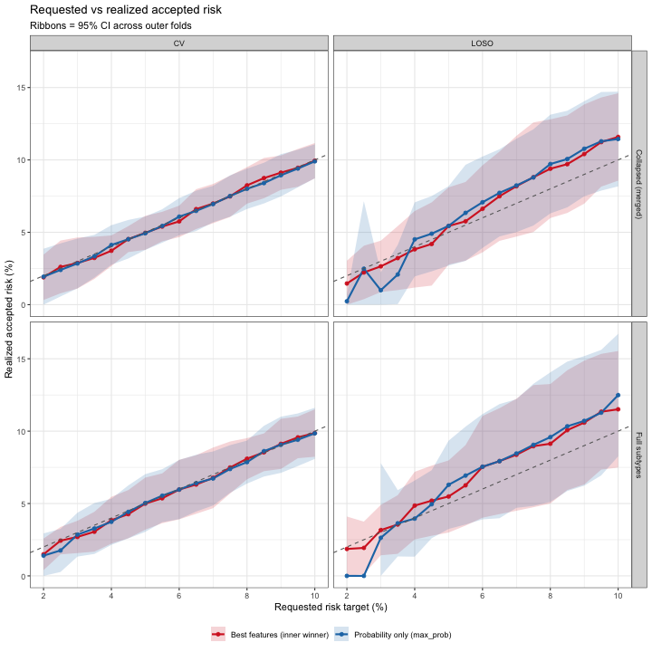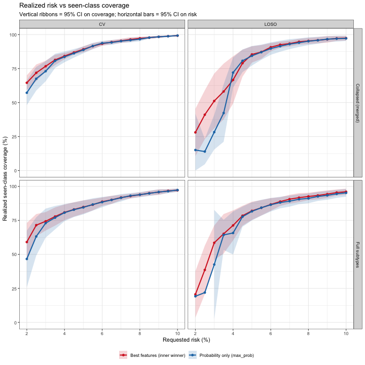

``` r
p_sub_1 <- p_compare_requested_vs_realized_risk + p_compare_risk_vs_coverage
```

## Requested vs realized risk: calibration slope (β)

From `nested_target_risk_calibration_compare.csv`: OLS **realized risk (%) ~ requested risk (%)** at each point on the 1–10% sweep (cross-fold means). **β = 1** is perfect calibration; smaller **|β − 1|** is better.


``` r
if (nrow(calibration_compare_df) == 0L) {
  knitr::kable(data.frame(
    note = "No nested_target_risk_calibration_compare.csv — rerun Rscript R/calibration_reject_models.R"
  ))
} else {
  slope_display <- calibration_compare_df %>%
    group_by(label_set, split_type, setting_col, calibration_recipe) %>%
    group_modify(function(d, ...) {
      fit <- stats::lm(realized_risk_pct ~ requested_target_risk_pct, data = d)
      beta <- unname(stats::coef(fit)[["requested_target_risk_pct"]])
      data.frame(
        n_points = nrow(d),
        slope_beta = beta,
        intercept = unname(stats::coef(fit)[["(Intercept)"]]),
        abs_slope_minus_1 = abs(beta - 1),
        stringsAsFactors = FALSE
      )
    }) %>%
    ungroup() %>%
    mutate(
      split_type = factor(toupper(as.character(split_type)), levels = SPLIT_TYPE_LEVELS),
      label_display = label_set_to_display(label_set),
      calibration_model = dplyr::recode(
        as.character(calibration_recipe),
        inner_best_features = "Best features",
        max_prob_only = "Max AML class probability only"
      )
    ) %>%
    group_by(label_display, split_type) %>%
    mutate(closer_to_perfect = abs_slope_minus_1 == min(abs_slope_minus_1)) %>%
    ungroup() %>%
    select(
      label_display, split_type, setting_col, calibration_model,
      n_points, slope_beta, intercept, abs_slope_minus_1, closer_to_perfect
    ) %>%
    filter(split_type == "LOSO") %>%
    arrange(label_display, split_type, calibration_model)

  knitr::kable(slope_display, digits = 3)

  slope_wins <- slope_display %>%
    filter(closer_to_perfect) %>%
    count(calibration_model, name = "n_settings_closer")

  knitr::kable(
    slope_wins,
    caption = "Settings (of 4) where |β − 1| is smallest"
  )

  p_slope_beta <- ggplot(
    slope_display,
    aes(x = calibration_model, y = slope_beta, fill = calibration_model)
  ) +
    geom_col(width = 0.65) +
    geom_hline(yintercept = 1, linetype = "dashed", color = "grey40") +
    geom_text(aes(label = sprintf("%.2f", slope_beta)), vjust = -0.4, size = 3) +
    scale_fill_manual(
      values = c(
        "Best features" = "#d62728",
        "Max AML class probability only" = "#1f77b4"
      ),
      guide = "none"
    ) +
    facet_grid(label_display ~ .) +
    labs(
      title = "Calibration slope β (realized ~ requested risk)",
      x = NULL,
      y = "Slope β"
    ) +
    theme_bw() +
    theme(axis.text.x = element_text(angle = 35, hjust = 1)) + 
  ylim(0,2)
  print(p_slope_beta)
}
```

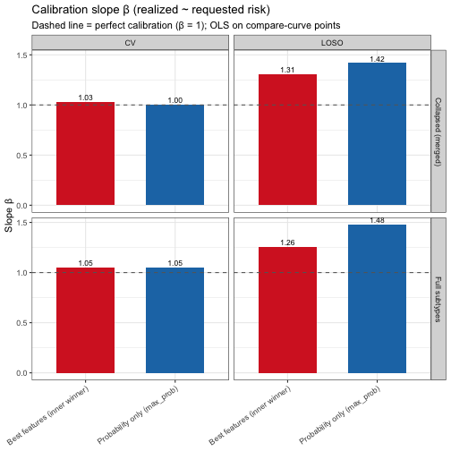

``` r
p2 <- p_slope_beta
```

## Probability distributions for correct, incorrect, and OOD (multivariate model)

Histogram, boxplot, violin, and **ggridges** density ridges of the **multivariate accept probability** assigned by the calibrated rejector (same RHS as the fused inner winner for each outer fold).

Each sample is bucketed into (plot order: Incorrect → OOD → Correct):
- **Incorrect**: `correct == 0` and `is_seen == 1`
- **OOD**: `is_seen == 0`
- **Correct**: `correct == 1` and `is_seen == 1`

We plot the predicted accept probability (`p_hat`) for **LOSO only**, facetted by label set
in this order: **Full subtypes**, then **Collapsed (merged)**.


``` r
source(file.path(repo_root, "R/utility_functions.R"))

per_fold_path <- file.path(
  repo_root,
  "data/out/outer_cv/calibration_feature_utility_selection_safe/nested_target_risk_per_fold.csv"
)

if (!file.exists(per_fold_path)) {
  knitr::kable(data.frame(note = "Need nested_target_risk_per_fold.csv — rerun R/calibration_reject_models.R"))
} else {
  per_fold_df <- readr::read_csv(per_fold_path, show_col_types = FALSE)
  per_fold_df <- per_fold_df %>%
    mutate(
      split_type = toupper(as.character(split_type)),
      label_display = label_set_to_display(label_set)
    )

  # Extract rejection features and fit P(accept_combined) on the outer-pool; score the target fold.
  extract_accept_features <- function(prob_matrix) {
    feats <- get_rejection_features_from_matrix(prob_matrix)
    # Keep true class labels for class-wise seen/OOD probability boxplots.
    feats$true_class <- if ("y" %in% colnames(prob_matrix)) gsub("Class\\. ", "", prob_matrix$y) else NA_character_
    feats$is_seen <- if ("is_leftout" %in% colnames(prob_matrix)) as.integer(!as.logical(prob_matrix$is_leftout)) else 1L
    feats$accept_combined <- as.integer(feats$correct == 1L & feats$is_seen == 1L)
    feats
  }

  fit_accept_glm_on_pool <- function(pool_fold_mats, rhs_terms) {
    if (length(pool_fold_mats) == 0L) return(NULL)
    pool_df <- dplyr::bind_rows(lapply(pool_fold_mats, extract_accept_features))
    rhs_terms <- rhs_terms[rhs_terms %in% colnames(pool_df)]
    if (length(rhs_terms) == 0L) return(NULL)
    df <- pool_df[, unique(c("accept_combined", rhs_terms)), drop = FALSE] %>%
      dplyr::filter(complete.cases(.))
    if (nrow(df) < 20L || length(unique(df$accept_combined)) < 2L) return(NULL)
    stats::glm(
      stats::as.formula(paste("accept_combined ~", paste(rhs_terms, collapse = " + "))),
      data = df,
      family = stats::binomial(),
      control = stats::glm.control(maxit = 200, epsilon = 1e-8)
    )
  }

  score_target_fold <- function(target_mat, glm_fit, rhs_terms) {
    if (is.null(glm_fit)) return(NULL)
    feats <- extract_accept_features(target_mat)
    rhs_terms <- rhs_terms[rhs_terms %in% colnames(feats)]
    # Keep class labels so downstream class-wise boxplots can use them on the x-axis.
    keep_cols <- unique(c("is_seen", "correct", "true_class", "pred_class", rhs_terms))
    keep_cols <- keep_cols[keep_cols %in% colnames(feats)]
    pred_df <- feats[, keep_cols, drop = FALSE] %>%
      dplyr::filter(complete.cases(.))
    if (nrow(pred_df) == 0L) return(NULL)
    p_hat <- as.numeric(stats::predict(glm_fit, newdata = pred_df[, rhs_terms, drop = FALSE], type = "response"))
    pred_df$p_hat <- p_hat
    pred_df
  }

  # Load outer fold probability matrices for the Global Product Optimized rejector scoring.
  # These contain the probability-matrix objects used by calibration_reject_models.R.
  outer_unmerged_path <- file.path(
    repo_root,
    "data/out/outer_cv/outer_cv_analysis_outputs_unmerged_maxprob/outer_cv_results.rds"
  )
  outer_merged_path <- file.path(
    repo_root,
    "data/out/outer_cv/outer_cv_analysis_outputs_merged_summed/outer_cv_results.rds"
  )

  if (!file.exists(outer_unmerged_path) || !file.exists(outer_merged_path)) {
    knitr::kable(data.frame(note = "Outer CV results RDS not found — regenerate outer_cv_analysis_outputs_* and rerun."))
  } else {
    outer_unmerged <- readRDS(outer_unmerged_path)
    outer_merged <- readRDS(outer_merged_path)

    # Map label_display to the right loaded R object.
    get_results_obj <- function(label_display) {
      if (label_display == "Full subtypes") outer_unmerged else outer_merged
    }

    SCENARIO_KEY <- "with_leftout_ood_aware"
    TARGET_BASE_MODEL <- "Global_Product_Optimized"

    all_rows <- list()
    ri <- 1L

    for (label_disp in LABEL_DISPLAY_LEVELS) {
      res_obj <- get_results_obj(label_disp)
      fam0 <- res_obj$multivariate_results[[SCENARIO_KEY]][[TARGET_BASE_MODEL]]

      for (split_type_fac in SPLIT_TYPE_LEVELS) {
        split_key <- tolower(split_type_fac)
        if (is.null(fam0[[split_key]]$fold_matrices)) next
        fold_mats <- fam0[[split_key]]$fold_matrices
        fold_names <- names(fold_mats)

        pf_sub <- per_fold_df %>%
          dplyr::filter(label_display == label_disp, split_type == split_type_fac)

        for (fold_id in fold_names) {
          row <- pf_sub %>% dplyr::filter(as.character(target_fold) == as.character(fold_id)) %>% dplyr::slice(1)
          if (nrow(row) != 1L) next
          rhs_key <- as.character(row$inner_winner_rhs_key[[1]])
          rhs_terms <- strsplit(rhs_key, ";", fixed = TRUE)[[1]]
          glm_fit <- fit_accept_glm_on_pool(fold_mats[setdiff(fold_names, fold_id)], rhs_terms)
          scored <- score_target_fold(fold_mats[[fold_id]], glm_fit, rhs_terms)
          if (is.null(scored)) next

          scored$label_display <- label_disp
          scored$split_type <- split_type_fac
          scored$fold <- as.character(fold_id)
          all_rows[[ri]] <- scored
          ri <- ri + 1L
        }
      }
    }

    prob_split_df <- if (length(all_rows) == 0L) data.frame() else dplyr::bind_rows(all_rows)
    if (nrow(prob_split_df) == 0L) {
      knitr::kable(data.frame(note = "No probability data produced for correct/incorrect/OOD split."))
    } else {
      # Requested figure layout: LOSO only, facetted by label set in the order
      # Full subtypes -> Collapsed (merged).
      loso_label_order <- c("Full subtypes", "Collapsed")
      prob_split_df <- prob_split_df %>%
        mutate(
          outcome = case_when(
            is_seen == 0L ~ "OOD",
            correct == 1L ~ "Correct",
            correct == 0L ~ "Incorrect",
            TRUE ~ NA_character_
          ),
          outcome = factor(outcome, levels = c("Incorrect", "OOD", "Correct"))
        ) %>%
        filter(!is.na(outcome)) %>%
        filter(split_type == "LOSO") %>%
        mutate(
          split_type = factor(split_type, levels = "LOSO"),
          label_display = factor(label_display, levels = loso_label_order)
        )

      outcome_colors <- c(
        "Incorrect" = "#d95f02",
        "OOD" = "#7570b3",
        "Correct" = "#1b9e77"
      )

      hist_breaks <- seq(0, 1, length.out = 31)
      hist_bin_width <- diff(hist_breaks)[1] * 0.98
      prob_hist_df <- prob_split_df %>%
        mutate(
          bin_idx = cut(
            p_hat,
            breaks = hist_breaks,
            labels = FALSE,
            include.lowest = TRUE
          )
        ) %>%
        count(label_display, split_type, outcome, bin_idx, name = "n") %>%
        group_by(label_display, split_type, outcome) %>%
        mutate(pct = 100 * n / sum(n)) %>%
        ungroup() %>%
        mutate(bin_mid = (hist_breaks[bin_idx] + hist_breaks[bin_idx + 1L]) / 2)

      p_hist <- ggplot(prob_hist_df, aes(x = bin_mid, y = pct, fill = outcome, group = outcome)) +
        geom_col(
          alpha = 0.55,
          width = hist_bin_width,
          position = position_identity()
        ) +
        facet_grid(. ~ label_display) +
        scale_fill_manual(values = outcome_colors, name = "Outcome") +
        labs(
          title = "Multivariate accept probability by correctness vs OOD",
          subtitle = "Each outcome stratum sums to 100% (300% across the three overlaid distributions)",
          x = "Multivariate accept probability (p_hat)",
          y = "% within outcome stratum"
        ) +
        theme_bw()
      print(p_hist)

      p_box <- ggplot(prob_split_df, aes(x = outcome, y = p_hat, fill = outcome)) +
        geom_boxplot(outlier.alpha = 0.4) +
        facet_wrap(~ label_display, ncol = 2) +
        scale_fill_manual(values = outcome_colors, guide = "none") +
        labs(
          title = "Multivariate accept probability by correctness vs OOD",
          x = NULL,
          y = "Multivariate accept probability (p_hat)"
        ) +
        theme_bw()
      print(p_box)

      p_violin <- ggplot(prob_split_df, aes(x = outcome, y = p_hat, fill = outcome)) +
        geom_violin(
          bounds = c(0, 1),
          trim = TRUE,
          alpha = 0.75,
          linewidth = 0.3
        ) +
        facet_grid(label_display ~ .) +
        scale_y_continuous(limits = c(0, 1), expand = expansion(mult = c(0.02, 0))) +
        scale_fill_manual(values = outcome_colors, guide = "none") +
        labs(
          title = "Multivariate accept probability by correctness vs OOD",
          x = NULL,
          y = "Multivariate accept probability (p_hat)"
        ) +
        theme_bw()
      print(p_violin)

      p_ridges <- ggplot(
        prob_split_df,
        aes(x = p_hat, y = outcome, fill = outcome, color = outcome)
      ) +
        geom_density_ridges(
          aes(point_color = outcome),
          scale = 2,
          alpha = 0.4,
          rel_min_height = -0.01,
          bounds = c(0, 1),
          linewidth = 0.35,
          jittered_points = TRUE,
          point_alpha = 0.3,
          point_size = 0.4
        ) +
        geom_rug(
          aes(color = outcome),
          sides = "b",
          alpha = 0.4,
          length = unit(0.04, "npc"),
          linewidth = 0.25
        ) +
        facet_grid(label_display ~ .) +
        scale_x_continuous(limits = c(0, 1), expand = expansion(mult = c(0.02, 0))) +
        scale_fill_manual(values = outcome_colors, guide = "none") +
        scale_color_manual(
          values = outcome_colors,
          guide = "none",
          aesthetics = c("color", "point_color")
        ) +
        labs(
          title = NULL,
          x = "Accept/reject probability",
          y = "Assignment"
        ) +
        scale_y_discrete(
          limits = c("OOD", "Incorrect", "Correct"),
          labels = c("OOD", "Incorrect", "Correct")
        ) +
        theme_ridges() +
        theme(
          legend.position = "bottom",
          axis.text.y = element_text(size = 10),
          axis.title.y = element_text(size = 11)
        )
      print(p_ridges)
    }
  }
}
```

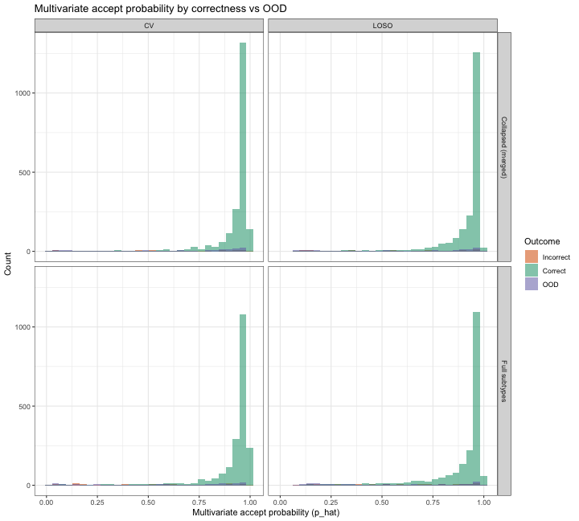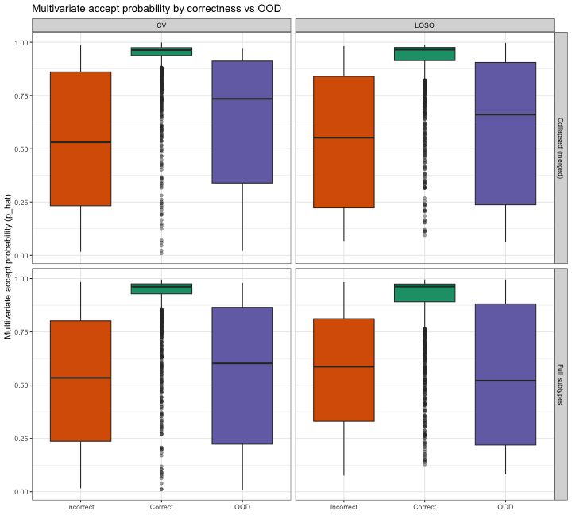

``` r
p3 <- p_ridges
```


### Seen-class boxplots by class and correctness

Seen-class (`is_seen == 1`) multivariate accept probability (`p_hat`) by class on the x-axis, split by correctness (Correct vs Incorrect).


``` r
if (!exists("prob_split_df") || nrow(prob_split_df) == 0L) {
  knitr::kable(data.frame(
    note = "Run prob_distributions_correct_incorrect_ood chunk first to build prob_split_df."
  ))
} else {
  seen_class_df <- prob_split_df %>%
    filter(is_seen == 1L) %>%
    mutate(correctness = if_else(correct == 1L, "Correct", "Incorrect"))

  if ("true_class" %in% colnames(seen_class_df)) {
    seen_class_df$class_label <- pretty_class_label(seen_class_df$true_class)
  } else if ("pred_class" %in% colnames(seen_class_df)) {
    seen_class_df$class_label <- pretty_class_label(seen_class_df$pred_class)
  } else {
    stop("Expected one of true_class or pred_class in prob_split_df for class-wise boxplots.")
  }

  seen_class_df$class_label <- factor(
    as.character(seen_class_df$class_label),
    levels = levels(seen_class_df$class_label)
  )
  seen_class_df$correctness <- factor(seen_class_df$correctness, levels = c("Incorrect", "Correct"))

  p_seen_class_box <- ggplot(
    seen_class_df %>% filter(label_display == "Full subtypes", split_type == "LOSO"),
    aes(x = class_label, y = p_hat, fill = correctness)
  ) +
    geom_boxplot(
      outlier.alpha = 0.25,
      position = position_dodge(width = 0.75),
      width = 0.68
    ) +
    #facet_grid(label_display ~ split_type) +
    scale_fill_manual(values = c("Incorrect" = "#d95f02", "Correct" = "#1b9e77")) +
    scale_y_continuous(limits = c(0, 1), expand = expansion(mult = c(0.02, 0))) +
    labs(
      title = "Probability by class and correctness",
      x = "True AML class",
      y = "Accept/reject probability",
      fill = "Predicted AML class"
    ) +
    theme_bw() +
    theme(
      axis.text.x = element_text(angle = 60, hjust = 1),
      legend.position = "bottom"
    )
  print(p_seen_class_box)
}
```


### Unseen-class boxplots by class (OOD only)

Unseen-class (`is_seen == 0`) multivariate accept probability (`p_hat`) by class on the x-axis (no correctness grouping).


``` r
if (!exists("prob_split_df") || nrow(prob_split_df) == 0L) {
  knitr::kable(data.frame(
    note = "Run prob_distributions_correct_incorrect_ood chunk first to build prob_split_df."
  ))
} else {
  ood_class_df <- prob_split_df %>%
    filter(is_seen == 0L)

  if ("true_class" %in% colnames(ood_class_df)) {
    ood_class_df$class_label <- pretty_class_label(ood_class_df$true_class)
  } else if ("pred_class" %in% colnames(ood_class_df)) {
    ood_class_df$class_label <- pretty_class_label(ood_class_df$pred_class)
  } else {
    stop("Expected one of true_class or pred_class in prob_split_df for OOD class-wise boxplots.")
  }

  ood_class_df$class_label <- factor(
    as.character(ood_class_df$class_label),
    levels = levels(ood_class_df$class_label)
  )
ood_class_df$class_label <- relevel(ood_class_df$class_label, "AML, NOS")
  p_ood_class_box <- ggplot(
    ood_class_df %>% filter(label_display == "Full subtypes", split_type == "LOSO"),
    aes(x = class_label, y = p_hat)
  ) +
    geom_boxplot(
      outlier.alpha = 0.25,
      width = 0.68,
      fill = "#7570b3"
    ) +
    #facet_grid(label_display ~ split_type) +
    scale_y_continuous(limits = c(0, 1), expand = expansion(mult = c(0.02, 0))) +
    labs(
      title = "Probabilty by OOD class",
      x = "Unseen class",
      y = "Accept/reject probability"
    ) +
    theme_bw() +
    theme(axis.text.x = element_text(angle = 60, hjust = 1))
  print(p_ood_class_box)
}
```


``` r
base <- "../writing/figures_new/figure_rej"
dir.create(base)


ggsave(paste0(base, "/rr_curve.svg"),p_nested_by_label_requested_vs_realized_risk, height = 3, width = 6)

ggsave(paste0(base, "/rc_curve.svg"),p_nested_by_label_requested_vs_coverage, height = 3, width = 6)

ggsave(paste0(base, "/beta_slope.svg"),p2, height = 4, width = 3)


ggsave(paste0(base, "/probs.svg"),p3, height = 4.5, width = 4)

ggsave(paste0(base, "/seen_box.svg"),p_seen_class_box, height = 4.5, width = 6)

ggsave(paste0(base, "/ood_box.svg"),p_ood_class_box, height = 4.5, width = 6)

ggsave(paste0(base, "/rc_curve_multi_vs_1.svg"),p_compare_risk_vs_coverage, height = 4, width = 6)

ggsave(paste0(base, "/hm_features.svg"),p_features_hm, height = 4, width = 6)
```

